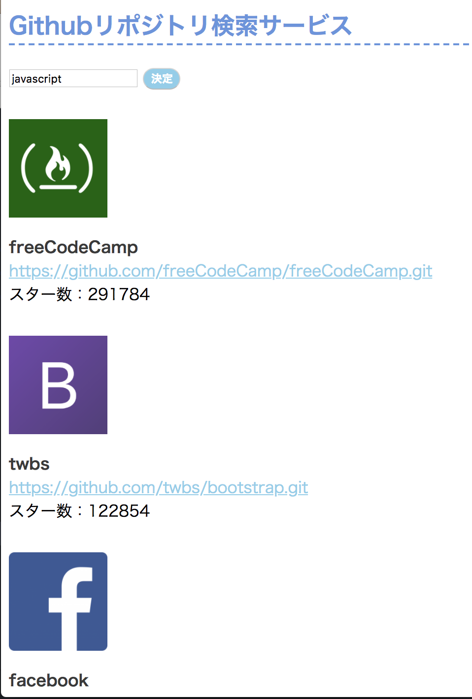

# github-search-repository

## Demo

https://toomoya.github.io/github-search-repository/

## Screenshot



## Required  

node

## Quick Start

```
$ cd github-search-repository
$ git clone git@github.com:Toomoya/github-search-repository.git
$ npm install .
$ npm run start
-> Server running at http://localhost:1234
```

## Deploy

```
$ npm run build
$ npm run deploy
```
